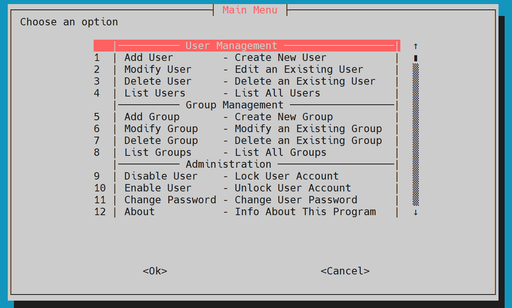
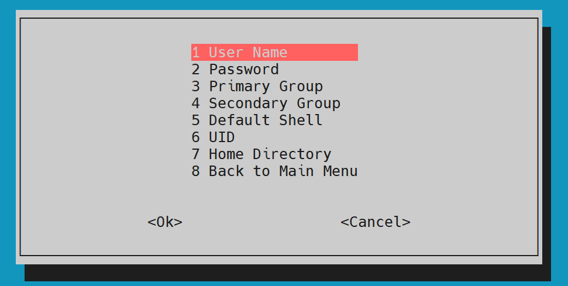

# 👤 Linux User & Group Manager Script (Whiptail-based)

Welcome to the **Linux User & Group Management Tool** — a simple interactive Bash script built with `whiptail` for managing users and groups on Linux systems via a friendly TUI (Text User Interface).

---

## 📸 Screenshots


**🔻 Main Menu:**


**🔻 Add User:**


**🔻 Checks for empty user_name:**


**🔻 Password:**


**🔻 Password Hint:**


**🔻 Password Confirmation:**


**🔻 Modify User Options:**


**🔻 And So many other options:**

---

## 🎥 Demo Video


[](https://drive.google.com/file/d/1WyspyTiQUbhAAhIDBEaaMIMVp7nJvjbt/view?usp=drive_link)


---

## ⚙️ Features

- Add, modify, and delete users.
- Change user password, shell, UID, groups, and home directory.
- Lock/unlock users, force password change.
- Add, rename, and delete groups.
- Clean and simple whiptail-based UI.
- Input validation (UID range, password strength, group existence).
- 💥 **Root user check** to prevent unauthorized use.

---

## 📋 Requirements

- Bash Shell
- `whiptail`
- `openssl` (for secure password hashing)

You can install `whiptail` via:
```bash
sudo apt install whiptail   # Debian/Ubuntu
sudo dnf install newt       # RHEL/CentOS/Fedora
```
---

## 🚀 How to Use
```
chmod +x user_group_manager.sh
sudo ./user_group_manager.sh
```
---

## 🏗️ Project Structure
```
.
├── user_group_manager.sh      # Main script
├── README.md                  # This file
└── screenshots/               #
```
---

## 👨‍💻 Author

**Karim Khaled**  
[LinkedIn](https://www.linkedin.com/in/karim-khaled-ahmed-a9993a360) | [Gmail](mailto:karimkhaled345444@gmail.com)

